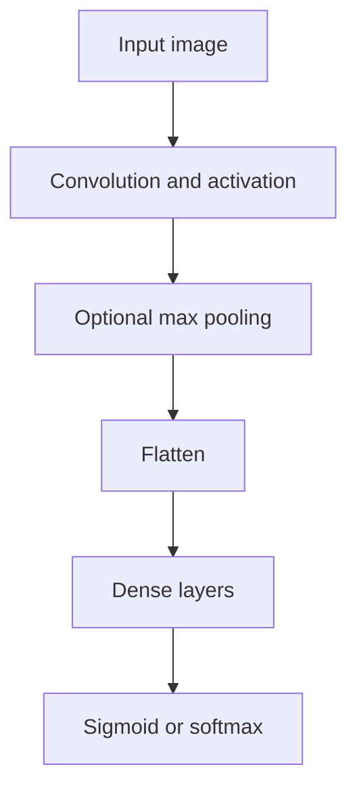
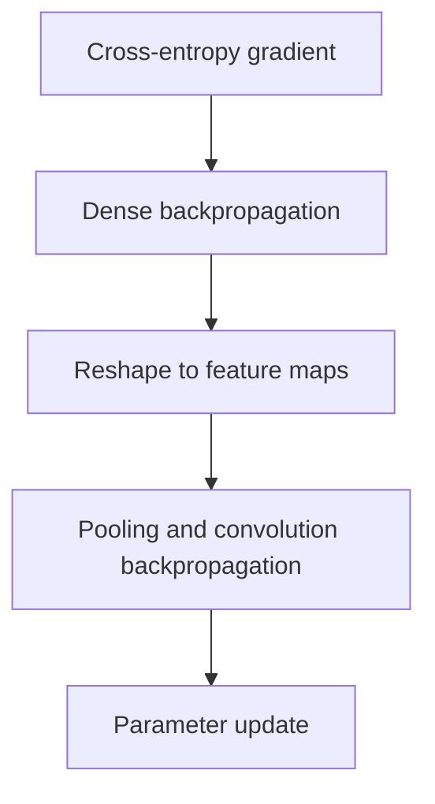

# Convolutional Neural Network Framework from Scratch

A first-principles implementation of convolutional neural networks using NumPy, including manual forward propagation, backpropagation, mini-batch training, momentum, L2 regularization, and stochastic variance-reduced gradient optimization.

This project was built independently to understand what deep-learning frameworks perform internally. The model does not rely on automatic differentiation or prebuilt neural-network layers: convolution, pooling, dense layers, gradient computation, parameter updates, and training logic are implemented explicitly.

## Project goals

Modern frameworks make it easy to assemble a CNN, but they hide much of the underlying numerical work. This project focuses on deriving and implementing that work directly:

- translating the mathematics of convolution into array operations;
- tracking tensor shapes across convolutional and fully connected layers;
- caching intermediate values required for reverse-mode differentiation;
- propagating gradients through nonlinearities, max pooling, convolution, and dense layers;
- supporting both binary and multiclass classification;
- comparing standard stochastic optimization with variance reduction.

The result is an educational framework rather than a replacement for PyTorch or TensorFlow.

## Implemented components

### Neural-network operations

- Multi-layer 2D convolution with configurable filter counts, kernel sizes, input channels, and stride
- ReLU and tanh hidden activations
- Sigmoid output for binary classification
- Softmax output for multiclass classification
- Max-pooling forward pass with cached argmax locations
- Max-pooling backward pass that routes gradients through the selected maxima
- Flattening between convolutional and dense parts of the network
- Multi-layer fully connected networks
- He-style initialization for ReLU networks and Xavier-style scaling for tanh networks

### Training and optimization

- Explicit forward and backward propagation
- Binary and categorical cross-entropy
- Numerically stable loss calculations from logits
- Mini-batch gradient descent
- Momentum-based parameter updates
- L2 weight decay
- Training/validation splitting
- Best-validation parameter snapshots
- Stochastic Variance Reduced Gradient (SVRG)

### Experiments

The notebook contains two end-to-end classification workflows:

- binary cat-versus-non-cat image classification on 64 × 64 RGB images;
- multiclass handwritten-digit classification on 28 × 28 grayscale images.

Dataset files are loaded from Google Drive and are not included in this repository.

## Architecture



During training, each layer stores the intermediate tensors and metadata needed by the backward pass:



## Backpropagation design

For a dense layer,

```text
Z[l] = W[l] A[l-1] + b[l]
A[l] = activation(Z[l])
```

the implementation computes:

```text
dW[l] = (1 / m) dZ[l] A[l-1]^T
db[l] = (1 / m) sum(dZ[l])
dA[l-1] = W[l]^T dZ[l]
```

For each convolutional filter, the backward pass accumulates gradients over every spatial patch used during the forward pass. It computes gradients with respect to the filter, bias, and previous activation tensor. When max pooling is enabled, stored argmax indices route each upstream gradient back to the correct input position.

The implementation deliberately keeps these steps visible instead of delegating them to an automatic-differentiation engine.

## Optimization methods

### Mini-batch SGD

The standard training loop:

1. shuffles the training observations;
2. computes predictions for a mini-batch;
3. calculates dense and convolutional gradients;
4. optionally adds L2 weight decay;
5. optionally filters gradients through momentum;
6. updates every trainable parameter;
7. evaluates training and validation accuracy and loss.

### SVRG

The SVRG implementation periodically stores a parameter snapshot and calculates a full-data reference gradient. A stochastic gradient is then corrected using

```text
g_tilde = grad_i(w) - grad_i(w_snapshot) + full_grad(w_snapshot)
```

This explores how variance reduction changes stochastic optimization while preserving the same manually implemented CNN and gradient structures.

## Repository contents

```text
.
├── README.md
└── konvulutivne_neuronske_mreze_sa_vise_slojeva.ipynb
```

The notebook combines mathematical notes, implementation, training experiments, and prediction visualization.

## Running the notebook

The project was developed in Google Colab.

1. Open `konvulutivne_neuronske_mreze_sa_vise_slojeva.ipynb` in Colab or Jupyter.
2. Provide the expected CSV datasets or update the dataset-loading cells.
3. Install the required libraries if they are not already available:

```bash
pip install numpy pandas matplotlib scipy keras
```

4. Run the notebook cells in order.

The original experiments expect files such as:

```text
cat_train_x.csv
cat_train_y.csv
cat_test_x.csv
cat_test_y.csv
traindig.csv
testdig.csv
```

Because paths currently point to the author's Google Drive, they must be changed for another environment.

## Example configuration

Binary RGB classification is configured using tuples of
`(number_of_filters, kernel_height, kernel_width, input_channels)`:

```python
conv_layers = [
    (2, 3, 3, 3),
    (16, 3, 3, 2),
]

fc_layers = [32, 1]
```

The notebook also defines a deeper multiclass configuration for grayscale digits:

```python
conv_layers = [
    (8, 3, 3, 1),
    (16, 3, 3, 8),
    (32, 3, 3, 16),
]

fc_layers = [64, 10]
```

## What this project demonstrates

- A mathematical understanding of convolutional networks beyond framework-level API usage
- Ability to derive and implement gradients for a multi-stage computational graph
- Careful management of tensors, cached states, parameter dictionaries, and gradient shapes
- Implementation of optimization algorithms rather than merely configuring library optimizers
- Understanding of binary and multiclass learning objectives
- Independent debugging of a complete training and inference pipeline

## Current limitations

This is a learning-oriented research notebook and has several known limitations:

- Convolution and batch processing use Python loops and are therefore much slower than vectorized, compiled, or GPU implementations.
- Padding, dilation, grouped convolution, dropout execution, and modern normalization layers are not part of the completed CNN pipeline.
- The notebook depends on external CSV files and Colab-specific paths.
- Experiments are interleaved with implementation and diagnostic cells rather than packaged as reusable Python modules.
- There are no automated unit tests or numerical gradient checks.
- Saved outputs do not provide a complete reproducible benchmark across optimizers.
- Some final exploratory prediction cells require cleanup to consistently use the matching architecture and parameter set.

## Recommended next steps

- Split layers, losses, optimizers, and training utilities into importable modules.
- Add finite-difference gradient checks for dense, convolution, and pooling operations.
- Add unit tests for tensor shapes, edge cases, and parameter updates.
- Vectorize convolution with `im2col`, stride tricks, or `einsum` and benchmark the speedup.
- Add reproducible dataset-download and preprocessing scripts.
- Report train/validation/test metrics with fixed seeds and comparable optimizer settings.
- Compare the NumPy implementation against an equivalent PyTorch model.

## Scope

This repository is intended to demonstrate first-principles understanding of CNN mechanics and optimization. It should not be used as a production deep-learning framework.
